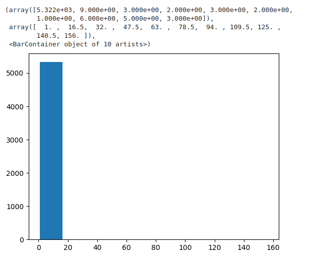
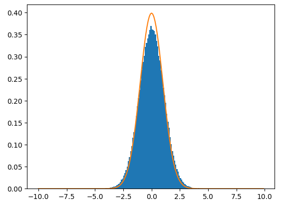

## Description

**Overall goal**: Check that DP1 flux errors are not biased.

For each of the source tables, select all light curves with no obvious variability 
and plot the relative deviation histogram. Remove all datapoints with ANY flags. 
Compare the histogram with the standard distribution.

1. For each type of the photometric product (forced sources, DIA sources, DIA forced sources) 
   and each passband, select all light curves with at least 10 observations and no obvious 
   variability (no points beyond 10-sigma).
2. Find weighted mean flux per object: \
	`wmean_flux = np.average(flux, weights=1/flux_error**2)`
3. Get relative deviations: \
	`rel_dev = (flux - wmean_flux) / flux_error`
4. Plot the distribution of relative deviations, accumulating them over all the objects, 
   as a histogram. Compare with the standard distribution within rel_dev values between -3 and 3.
5. Bonus points for making a statistical test and running the analysis per field and per magnitude bin (for example one-mag-wide).

## Pain Points and Questions

* understanding how to get the data into nested format
* what can I do inside that `map_partitions` once I have a nested frame?
* `map_partitions` felt like the right solution, until i was using the full catalog, and the
  tasks were just too big.
* want to be able to pass kwargs to `.compute()` (i think). e.g. `concatenate=False`.
* PLEASE want progress bar PLEASE.
* `dask.distributed.print` is great IF YOU KNOW ABOUT IT.
* I ran on USDF RSP, and could only get anything useful with a large instance and client 
  config `Client(n_workers=1, threads_per_worker=1, memory_limit="10GB")`. Is that realistic?
* Pretty common pattern of `reduce` then `.loc` based on querying the reduce result. Is this a 
  *good* pattern? If yes - can we provide a tutorial that does that?
* Better to have a single map partition ufunc with all of the operations, or split it into 
  individual reduce, query, loc calls?


## Lab notes

### Tuesday, March 18

Goal for today: step 1. Get boring lightcurves.

So. How do I filter out rows where the lightcurves are too short? The painfully obvious things I'm doing aren't working.

The silly brute force method seems to work ok. So I'm going to go with that for a little while.

```
obs_mask = [len(n) > 1 for n in field_frame["diaSource"]]
field_frame = field_frame[obs_mask]
```

But trying this on THE ENTIRE `diaObject` catalog is taking fooooorrrreeevvveeerrr. Sure wish we
could have a progress bar, like civilized people.

But also, the distribution of lightcurve lengths is whack.



Look at that! 99%+ of diaObjects have lightcurves that have JUST ONE observation. Neven says these are "fake detections".
This might not be a very useful data set. Maybe I should have started with `object_lc` instead...

### Thursday

What happened to Wednesday?!

USDF RSP won't start a notebook instance for me. So I'm going to wait an hour and see if that clears ... something. 
That worked last time.

### Monday

What happened to Friday?!

Found a strategy to get objects with at least 10 observations. I can only do this for 4 pixels at a time,
or the `map_partitions` operation tries to fuse too many partitions into a single task and runs out of
memory. This is frustrating, but whatever.

### Tuesday

I have other problems. I need to do this per-band.

But even in the problem statement, it's "per data product type and per-pass band", so maybe it's not
too crazy to do the whole shebang six times over (i.e. once per band).

But there are basically no good objects. Because `detect_isPrimary` is False for ~everything. 
I need to be using weekly 11.

Starting again...

I found some light curves!!!

On to the "with no obvious variability (no points beyond 10-sigma)" thing.

Getting some mixed messaging from Kostya and Neven and Google, but settled on something I'm happy with.



C'mon - wouldn't you be happy with that too?

That's only for one partition in `object_lc`, and only in the `r` band. I'll try to get the full stuff going.
